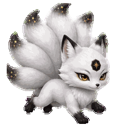
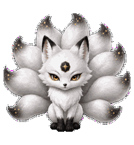
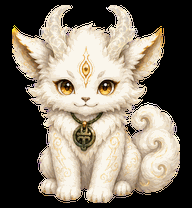

# desk-pet

Codex 自定义桌宠仓库。目前收录两个可独立安装的阿衡形态：

- **九尾狐阿衡**：银白蓬松、深金眼睛、黑金尾尖和额心九边形星核。
- **白泽阿衡**：雪白蓬松、带月白玉角和琥珀金眼的幼年白泽。

## 九尾狐阿衡





- 宠物 ID：`a-heng`
- 当前版本：`v0.1.3`
- 图集规格：Codex v2，`1536×2288`，`8×11`，RGBA WebP
- 视觉特征：正面状态保持九条可数清的银白巨尾、流畅黑金尾尖、墨黑耳尖与小爪、额心黑色九边形星核
- 左右跑动：恢复初版侧身前倾、四肢舒展、尾群向后流动的奔跑姿态；侧视中允许九尾因透视自然遮挡
- 鼠标回应：轻压身蓄力、小幅跳起并落下，最后稳定回到坐姿
- 方向响应：四个基准方向通过，完整 16 向注视保持九尾、星核和身份连续

[查看完整动作图集](docs/images/a-heng-contact-sheet.png) · [查看验证摘要](qa/a-heng-validation.json)



## 白泽阿衡

- 宠物 ID：`baize-aheng`
- 图集规格：Codex v2，`1536×2288`，`8×11`，RGBA WebP
- 视觉特征：绒毛层次、珍珠釉面淡金纹、额心神目、墨绿色玉牌和祥云尾
- 鼠标回应：先停顿并竖耳，再抬爪招呼，最后稳定回到坐姿
- 跑动与触碰动作均已检查头身比例和尺寸连续性

[查看完整动作图集](docs/images/baize-aheng-contact-sheet.png) · [查看验证摘要](qa/validation.json)

## 安装

在仓库根目录选择喜欢的形态执行。

安装九尾狐阿衡：

```bash
mkdir -p "${CODEX_HOME:-$HOME/.codex}/pets/a-heng"
cp pets/a-heng/pet.json "${CODEX_HOME:-$HOME/.codex}/pets/a-heng/pet.json"
cp pets/a-heng/spritesheet.webp "${CODEX_HOME:-$HOME/.codex}/pets/a-heng/spritesheet.webp"
```

安装白泽阿衡：

```bash
mkdir -p "${CODEX_HOME:-$HOME/.codex}/pets/baize-aheng"
cp pets/baize-aheng/pet.json "${CODEX_HOME:-$HOME/.codex}/pets/baize-aheng/pet.json"
cp pets/baize-aheng/spritesheet.webp "${CODEX_HOME:-$HOME/.codex}/pets/baize-aheng/spritesheet.webp"
```

随后在 Codex 的“设置 → 宠物”页面点击刷新，并选择对应形态。

## 仓库口径

本仓库只保留当前最新版和必要的预览、验证摘要。旧版备份、生成缓存、临时图集及本机绝对路径均不纳入版本控制。
